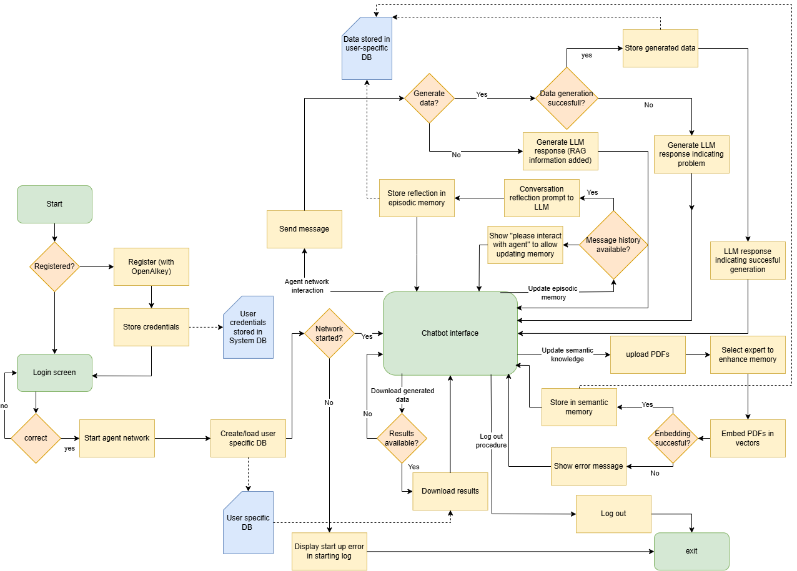
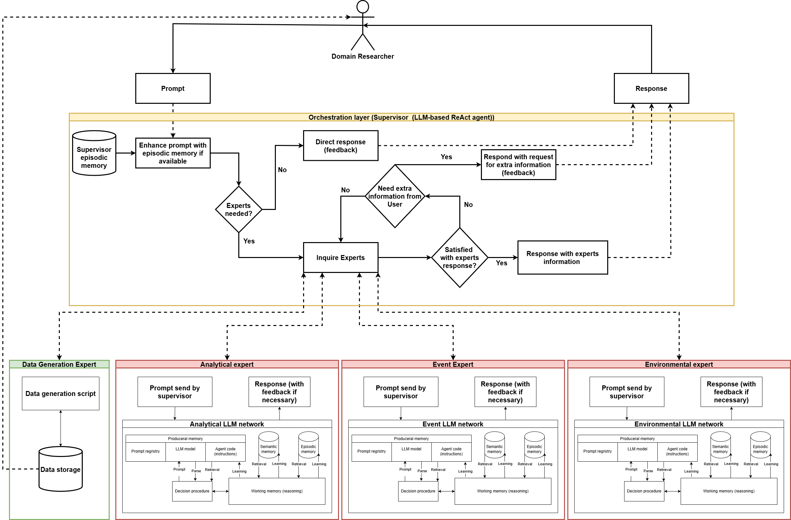

 # Collaborative Multi-Agent Health Behavior Persona Data Generation
A web-based chatbot implemented as proof-of-concept that leverages a LLM-based multi-agent architecture for the generation of health behavior persona data. By defining input variables based on a description in natural language from a domain researcher, health behavior personas are created. These variables are used to create a SMT-solver problem based on the constraints in the variables, this generates event data for the specified users (ran locally). The application uses an FastAPI backed, combined with a Streamlit fronted and PostgresSQL user-data storage. The multi-agent architecture is implemented in the hb_agent image and is based on LLMs by OpenAPI. In this image, expert agents based on the CoALA paper are initialized, this includes RAG (semantic memory), conversation memory (episodic memory) and an expert prompt (procedural memory). The memory components are initialized through ChromaDB, agent communication through langchain, and the supervisor is implemented as an ReAct agent (langgraph based). This is all deployed through Docker compose.

## Prerequisites
- Installation of Docker
- OpenAI key
- Local computing powers for SMT-solver z3

## Setup
- Clone the repository
- Use command docker compose up --build hb_agent to instigate image of hb_agent 
- Thereafter run docker compose up --build to launch program. 
- Initial chromaDB set-up for each created container (so each user signing up) can be created. Embed documents under the collection names: "general_environmental", "general_event", "general_analytical". This process is not implemented in the package and must be done manually. New documents for each specific user can be added through the interface.

## Interface
- Login screen to access the chatbot
- Register page should be used to add username, password and OpenAI key
- After login procedure user specific container is instigated with OpenAI key
- Chatbot interface has the following options:
    -  Update episodic memory after interaction
    -  Select expert and upload pdfs to embed through RAG, will afterwards be used in the response from the experts
    -  Download generated data
- The full flow is visualized in the UML diagram below

## Multi-agent Network Architecture
- The multi_agent network is based on one React supervisor and three experts:
    - analyst expert: an expert which extract the relations between the different events from the provided prompt and describes these relations using LTL. This is all returned in a standardized variable.
    - environmental expert: an expert which extracts environmental information from the provided prompt, such as the demographic of the health behavior persona. This is all returned in a standardized variable.
    - event expert: an expert which extracts information about the different events and their constraints from the provided prompt. These are quantitative, seasonal and trend constraints. This is all returned in a standardized variable.
    - The expert prompts used to instigate these experts and supervisor are available in HB_agent/Set_up/Templates
- Instigated additional experts is possible, but the supervisor prompt should be adjusted. Furthermore, the HB_Agent main.py should be adjusted to add the new experts.
- The Multi-agent Network is augmented with a tool to generate data. This tool uses the standardized variables to generate data, a description is available in the chapter Event data generation. 
- The proposed Multi-Agent Network Architecture is visualized below.

## Event data generation
- The event data generation folder in HB_Agent takes as input the 3 variables generated by the multi-agent architecture
- For the constant persona generation, the following elements are implemented: age_group, age, gender, education_level, occupation_status, marital_status, field_of_study, housing_type, time_window, number_of_subjects, horizon.
- For the analyst agent, the following inter event constraints are implemented: The following LTL constraints are currently implemented:
    - No Overlap: G ¬(A ∧ B) 
    - Implication (A implies B in future): G (A → F B) # on a daily basis
    - Event A must overlap with at least one event B: G (A → F (A ∧ B))
- The event constraints that are implemented are: 
    - per_event_duration: { min, max, unit }
    - total_event_duration_daily: { scale, min, max, unit }
    - total_event_episodes_daily: { scale, min, max, unit }
    - temporal_patterns:
        - seasonality
            - time window or day: morning", "afternoon", "evening", "night", "weekday", "weekend", "day_part"
            - direction: "increasing" or "decreasing"
            - amount: numeric in percentage
            - within which window or day : single (e.g., "morning", "weekend") or list (e.g., ["afternoon", "evening"], ["Saturday", "Sunday"])
        - trend
            - scale: season
            - direction: "increasing" or "decreasing"
            - amount: integer value of events to increase or decrease
            - within: time period number of days
            - start: the day the trend should start
            - end: the day the trend should end
        - fix
            - Used to fix an event to one time window (for example only night)
- The solver builds a model for each day, events that span the next day are extracted and implemented as spillover for the next day
- Therefore, the LTL constraints are also enforced on a per day basis
- The number of events to schedule each day are supplied to the solver, according to the implemented trends in combination with randomness. 
- A compliance check is added to the outputted data, this is not a strict pass/fail test. But functions mainly as an indication of the actual percentages of events scheduled at each time window/day. Deviations from the specified patterns occur due to the discrete nature of the event-based generation. 
- Lastly visualization plots are added to the generated data.
- This is all downloaded trough the zip implementation. 

## Test case
- For the test case we used the study of Paciorkowski et al. Four different smoking cessation profiles are identified in this study. The smoking behavior is described in a natural language prompt, adjusted to a horizon of 90 days to limit computational strain and augmented with additional events and inter-event relations. These inter-event relations are stored in a PDF which is available at HB_agent/Set_up/Semantic_memory and supplied to the semantic memory of the analytical agent. The results of these prompts and interaction logs are available in the folders : Long_term_quitters, Persistent_smokers, Repeated_try_and_fails and Short_term_returner. 

## References:
- Paciorkowski, M., Baty, F., Pohle, S., Bürki, E., Brutsche, M. (2022). Identification of smoking cessation phenotypes as a basis for individualized counseling: An explorative real-world cohort study. Tobacco Induced Diseases, 20(September), 81. https://doi.org/10.18332/tid/152546
- Sumers, T. R., Yao, S., Narasimhan, K., & Griffiths, T. L. (2024). Cognitive architectures for language agents (Version 3) [Preprint]. arXiv. https://arxiv.org/abs/2309.02427

